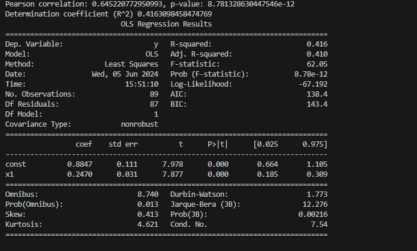

# exp 0.1.0 - Алгоритм выделения дыхательных волн из пульсовой волны 

# Начало работы

Установите python и git на ОС.
Откройте git bash в директории, которой будете работать. 
Склонируйте репозитрорий:

```
git clone https://github.com/AlexLarioEv/exp.git
```

Для работы программы необходимо скачать matplotlib scipy numpy pandas seaborn sklearn statsmodels:

```
pip install matplotlib scipy numpy pandas seaborn sklearn statsmodels
```

Добавьте в базу данных (exp/db/real) файл с форматом csv соддержащий сигнал от зафиксированного пульсоксиметра с временным интервалом 10 секунд

В файле constants измените fs (частоту дискретизации) для вашего входного сигнала

Для предпросмотра ваших результатов в консоле введите через терминал:

```
python app/params.py
```

Для записи результатов в базу данных для статистического анализа введите через терминал:

```
python app/writeDataStatistics.py
```

# Статистический анализ

После наполнения базы данных параметрами кардиореспираторной системы. Проведите статистический анализ для построения регрессионной модели:

```
python app/statistic.py
```

В консоле будет подробно описан вывод о регрессионной модели в виде таблицы: 



Если у вас возникли баги, ошибки или вопросы можете написать письмо автору на почту saschalar@mail.ru

# Файловая структура алгоритма

```
exp/
│
├── db/
│   ├── open/                       - ваши данные из открытых источников
│   │   └── open_data.csv
|   |       ...
│   ├── real/                       - ваши данные из реальных источников
│   │   └── real_data.csv
|   |       ...
│   └── statistics/                 - ваши данные для cтатистический анализа
│       └── dataBreath.csv
│
├── app/
│   ├── common/                     - простые функции
│   │   │── chartBuilder.py             - функции для построения графиков
│   │   │── transformSignals.py         - функции для работы с сигналом
│   |   └── __init__.py                 - файл инициализации
│   ├── service/                    - запросы в базу данных
│   │   │── getOpenSignal.py            - запрос в базу данных из открытого источника
│   │   │── getRealSignal.py            - запрос в базу данных из реального источника
│   |   └── __init__.py                 - файл инициализации
│   ├── breath.py                   - выделение дыхательных волн
│   ├── constants.py                - глобальные константы
│   ├── corr.py                     - построение пульсовой волны
│   ├── pulse.py                    - выделение пульсовых волн
│   |── PI.py                       - нахождение индекса перфузии
│   ├── params.py                   - нахождение параметров кардиореспираторной системы
│   ├── statistic.py                - статистический анализ
│   |── writeDataStatistics.py      - записи результатов в базу данных
│   └── index.py                    - построение дыхательных и пульсовых волн
├── image.png                       - рисунок получившейся регрессионной модели 
├── README.md
└── .gitignore
```